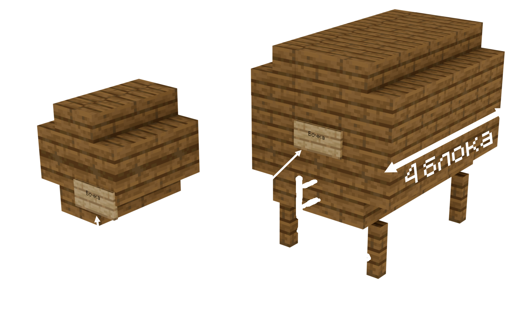

# Бравери

## Как начать варить



### Возьмите котёл и наполните его водой.



### Подставьте под котел источник тепла. Это может быть один из многих:

Огонь или огонь душ

Блоки лавы или магмы

Костер или костер душ



### Добавляйте ингредиенты для своего рецепта, щелкая правой кнопкой мыши по котлу с каждым из них.



### Используйте часы на котле, чтобы узнать, сколько времени варится напиток.



### Когда варка в котле продлится указанное время, используйте 3 стеклянные бутылки, чтобы полностью откачать содержимое котла.



На этом этапе приготовление некоторых рецептов может быть завершено! Другие рецепты могут потребовать выдержки и/или дистилляции.

## Старение напитков 

Выдержка — это функция, позволяющая выдерживать пиво,вино и т.п в бочках. В процессе выдержки напиток приобретает дополнительные эффекты и свойства в соответствии с рецептом. Процесс выдержки является опциональным для каждого сорта напитка и может быть настроен для каждого сорта

### Создание бочки 

Чтобы выдержать пиво, сначала нужно создать бочку. Бочки можно создать, разместив на блоках табличку с надписью «**Бочка»**&#x20;

<figure><figcaption></figcaption></figure>

Должно появиться сообщение "Бочка создана"\
\
После того, как вы разльете напитки в бочки, вам останется только подождать! 1 «год» равен 1 игровому дню. Если вы переборщите с напитком или используете неподходящий тип древесины, напиток, скорее всего, испортится.

### Дистилляция

1.Поставьте бутылку с ферментом в стойку для варки. 2.Добавьте светокаменную пыль в качестве фильтра в верхний слот стойки для варки (фильтр не будет израсходован).

<figure><figcaption></figcaption></figure>

После дистилляции вы получите более крепкий напиток или уникальный эффект

### Как стать трезлым

После употребления алкоголя проходит некоторое время, пока он полностью не выветрится. В это время уровень алкоголя неуклонно снижается. Также он может быть снижен за счет потребления предметов

* При выходе из игры в сильном подпитии может случиться так, что, войдя в игру через некоторое время, игрок обнаружит себя в совершенно незнакомом месте посреди пустыни, не имея ни малейшего представления о том, как он туда попал.
* Но если он снова войдет в игру через несколько часов или на следующее утро, то окажется в /home, опять же без каких-либо воспоминаний.
*   Также, если алкоголь был не самого лучшего качества, игрок может столкнуться с плохим похмельем (медлительность и голод).

