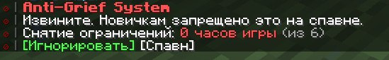

# Анти-Гриф

Анти-гриф — это совокупность мер, припятствующих нарушению правил игрового процесса. Сюда относят повреждение построек, контейнеров, кражи, спам лавой, огнем и так далее. Основная задача - сделать так, что бы у потенциальных нарушителей зашедших на сервер не было возможности реализовать свои подлые планы.

***

<figure><figcaption></figcaption></figure>

**На FLW.ONL используется целый ряд способов защиты от грифа, мы расскажем про каждый!**

#### 1. Anti-Grief System 

Для новых игроков в радиусе 100 блоков от 0 координаты запрещены следующие действия:

* Ломать и ставить блоки
* Наносить урон другим игрокам и энтити не обладающим интеллектом
* Наносить урон `armadillo`, `villager`, `cat`, `dog` и `allay`
* Взаимодействовать с интерактивными блоками и рамками

В мире ферм действуют собственные ограничения для новичков:

* Запрещено взаимодействовать со всем миром

#### 2. Общие ограничения по всему миру 

На основе старых механик, взяты ограничения, действующие на весь мир для **новых игроков**:

* Установка блоков типа `fire`, `lava`, `tnt`, `tnt_minecart`, `end_crystal` и `respawn_anchor`
* Разрушение контейнеров наполненных ресурсами
* Нанесение смертельного урона другим игрокам

#### 3. Общие ограничения для спавна 

Общие ограничения игровых механик для безопасного перемещения по спавну:

* Всё, что вызывает разрушительного характера взрывы - отключено
* Призыв визера

При соверешении запрещенному действия новому игроку высвечивается предупреждение. Новым игрокам доступна команда перемещения `/antigrief spawn` , которая телепортирует их на нулевые координаты, если они в зоне спавна (100 блоков от нулевых координат)

#### Уведомления имеют интерактивные кнопки с функционалом: 

* **Игнорировать**: Перевести уведомления в Action-Bar,
* **Спавн**: Копирует функционал `/antigrief spawn`


Новыми игроками считаются те, кто не наиграл на сервере 6 часов. На игроков, которые преодолели отметку в 6 часов геймплея, ограничения не распространяются

