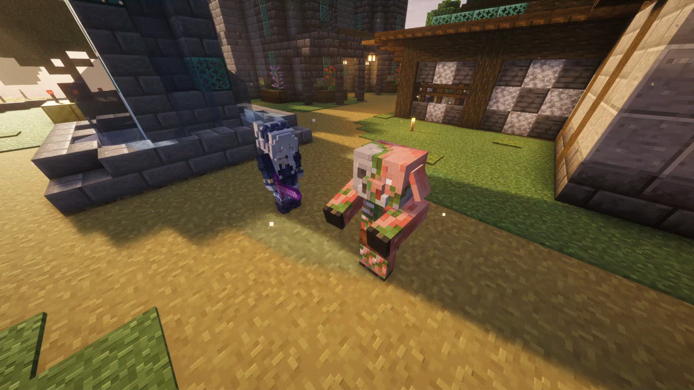

# Донат эффекты

### Аура «Бледный сад»

Ощутите себя в бледном саду с набором с частицами лепестков бледного дуба!

<figure><figcaption></figcaption></figure>

***

### Аура «Цветущая вишня»

Ощутите себя в вишнёвом саду с нашим набором с частицами лепестков цветущей вишни!

<figure><figcaption></figcaption></figure>

***

### Эффект «Нимб»

Зелёные ромбовидные частицы, которые появляются и исчезают над головой в виде кольца. Все эффекты появляются одновременно, поэтому нимб получается идеально ровным.

<figure><figcaption></figcaption></figure>

***

### Эффект «Сердечки»

Красные сердца, которые быстро появляются и исчезают в случайном месте над головой.

<figure><figcaption></figcaption></figure>

***

#### Аура «Чародей»

Мистическая аура, подчёркивающая ваш статус. След за метаемыми предметами в виде эндер частиц&#x20;

<figure><figcaption></figcaption></figure>

***

#### Набор «Музыкант»

Зелёные ноты, которые быстро появляются и исчезают в случайном месте над головой, след за метаемыми предметами в виде кучки зелёных нот. Эксклюзивная для набора особенность: трекер стрелы. После выстрела из лука, на протяжении всего полёта стрелы до момента, пока она не коснётся блока или моба, вы будете слышать каждые полсекунды невысокий звук. После попадания в блок или моба проиграется высокий звук.

<figure><figcaption></figcaption></figure>

***

#### Набор «Души Незера»

Частицы пепла и голубые огоньки душ вокруг игрока, след из душ и дымки под ногами, след за метаемыми предметами в виде разлетающихся от снаряда огоньков душ.

<figure><figcaption></figcaption></figure>

***

#### Трейл «Души Незера»

След из душ и дымки.

<figure><figcaption></figcaption></figure>

***

#### Набор «Незер»

Включает в себя огненные эффекты из огненной ауры – ранней версии набора «Незер», уникальные сообщения о входе/выходе из игры, огненный след, состоящий из огоньков и дыма, след за метаемыми предметами.

<figure><figcaption></figcaption></figure>

***

#### Аура «Огненная»

Частицы из биома «Базальтовые дельты» и дым вокруг игрока. Частицы брызг лавы за всеми метаемыми предметами.

<figure><figcaption></figcaption></figure>

***

#### Трейл «Огненный»

Частички огня и дыма под ногами игрока.

<figure><figcaption></figcaption></figure>

***

#### Аура «Тайны Энда»

Частицы стола зачарования и дыхания дракона вокруг игрока. Во время ходьбы за Вами на несколько секунд остаются частицы, исходящие от Эндерменов.

<figure><figcaption></figcaption></figure>

***

#### Эффект «Смертельный удар»

Нанесите сокрушительный удар! При нанесении урона мобу от него будут разлетаться красные черепки, а чем сильнее удар – тем их больше!

<figure><figcaption></figcaption></figure>
